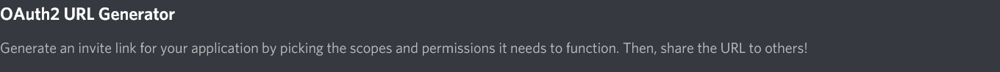

AxonalJuicer

AxonalJuicer is a Discord bot to generate images from text inspired by [NeuralBlender](https://neuralblender.com/). It is based on VQGAN+CLIP, an architecture published in [this notebook](https://colab.research.google.com/drive/1go6YwMFe5MX6XM9tv-cnQiSTU50N9EeT) made by Katherine Crowson ([GitHub](https://github.com/crowsonkb), [Twitter](https://twitter.com/RiversHaveWings)) and modified by Eleiber#8347 based on BigGAN+CLIP made by [advadnoun](https://twitter.com/advadnoun).

## Installation

1. If you want to run AxonalJuicer on an NVIDIA GPU, ensure that it works:

   ```
   nvidia-smi
   ```

2. Install [Anaconda](https://www.anaconda.com/products/individual).

3. Create and activate an environment:

   ```
   conda create -n <env name> python=3.10
   conda activate <env name>
   ```

4. Clone the repository and install the requirements:

   ```
   git clone https://github.com/butakow/AxonalJuicer
   cd AxonalJuicer
   pip install -r requirements.txt
   ```

## Creating a Bot Account and Inviting Your Bot

This section is adapted from [this section of the discord.py documentation](https://discordpy.readthedocs.io/en/stable/discord.html#creating-a-bot-account).

1. Log on to the [Discord application webpage](https://discord.com/developers/applications).

2. Click on the "New Application button".

   

3. Give the application a name and click "Create".

   

4. Create a Bot User by navigating to the "Bot" tab and clicking "Add Bot".

   - Click "Yes, do it!" to continue.

   

5. Copy the token using the "Copy" button.

6. Create a file named `config.py` in the `AxonalJuicer` directory containing the following:

   ```
   token = "<paste the token here>"
   ```

7. Go to the "OAuth2" > "URL Generator" tab.

   

8. Tick the "bot" and "applications.commands" checkboxes under "Scopes".

   

9. Go to the generated URL, select a server, and click "Authorize".

10. Follow [this guide](https://support.discord.com/hc/en-us/articles/206346498-Where-can-I-find-my-User-Server-Message-ID-) to copy the ID of the selected server.

11. Append the following line to `config.py`:

    ```
    server_id = <paste the server ID here>
    ```
